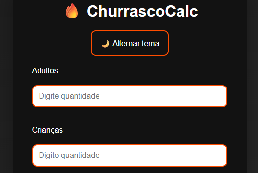
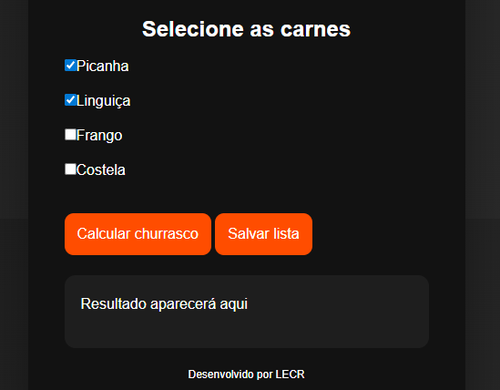
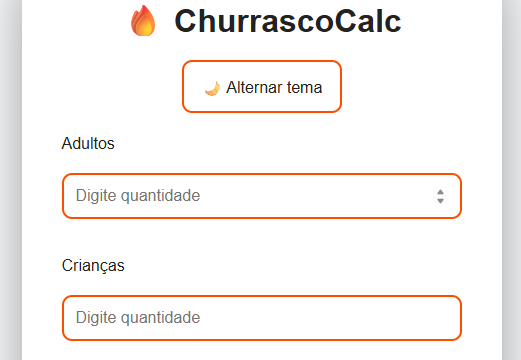
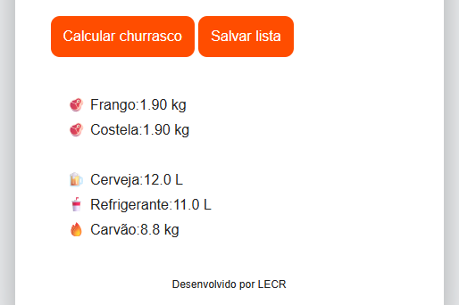

# 🔥 ChurrascoCalc 

Aplicação web inteligente para planejamento de churrascos.

Calcula automaticamente:
- quantidade de carnes
- bebidas
- carvão
- refrigerante

com base no número de participantes e tipos de carne selecionados.

---

## 🚀 Tecnologias

HTML5  
CSS3  
JavaScript  
LocalStorage API  

---

## 📊 Funcionalidades

✔ cálculo automático  
✔ seleção de carnes  
✔ lista dinâmica  
✔ salvar cálculo  
✔ layout moderno  

---

## 📸 Preview

---

## 📁 Estrutura

assets
css/style.css
js/script.js
index.html

---

## ▶️ Executar projeto

Clone:

git clone https://github.com/Lorenconde/churrasco-calc
Abrir:
index.html

---

## 💡 Melhorias futuras

modo premium churrasco completo
exportar PDF
modo festa grande
modo vegetariano
versão mobile app

---

## 👩‍💻 Desenvolvido por

Loren Conde

🔹 CSS — Estilização e layout.
🔹 JavaScript — Lógica de cálculo interativa.
